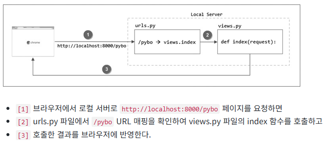
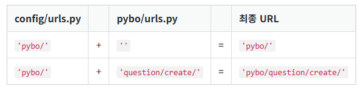

이 장의 목표

- urls.py 파일을 사용해 요청된 URL과 이를 처리하는 뷰 함수를 연결하는 방법을 익힌다. 
- 장고 ORM을 활용하여 데이터베이스 모델 생성, 데이터 추가 및 조회 방법을 익힌다. 
- 파이보 게시판에 질문 목록을 표시하고, 특정 질문의 세부 정보를 확인할 수 있는 기능을 구현한다.


## 2-01. URL과 뷰
### 앱(App)
프로젝트 단독으로 아무것도 할수 없다.  
프로젝트에 기능 추가를위해 앱을 만들어야한다.   
이제 게시판 기능을 담당할 pybo 앱을 생성한다.  

django-admin의 startapp 명령을 이용하여 pybo 앱을 생성하자.
```.bash
(mysite) C:\projects\mysite> django-admin startapp pybo
```


명령을 실행하면 아무런 메시지 없이 종료된다.   
하지만 pybo 앱 관련한 디렉터리와 파일이 생성되었음을 에디터에서 확인할 수 있다.

pybo 디렉토리 하위의 기능은 다음과 같다.

- migrations : migrations는 파일이 아닌 디렉터리이며 장고가 데이터베이스 테이블을 생성하고 수정하기 위한 파일들을 이곳에서 관리한다.
- admin.py : 장고의 관리자 화면을 구성하는 파일이다. 이 곳에 코드를 추가하여 장고 관리자 화면을 제어할수 있다.
- apps.py : 앱의 구성 정보를 정의하는 파일이다. (파이보 프로젝트에서 이 파일을 수정할 일은 없다.)
- models.py : 데이터베이스 모델을 정의하는 파일이다.
- tests.py : 앱을 테스트할 때 사용하는 파일이다.
- views.py : 앱의 기능을 구현하는 파일이다. 앞으로 가장 많이 사용할 파일이다.


### Hello Pybo
장고 프로그램을 만들자.  

브라우저에서 http://127.0.0.1:8000/pybo 페이지를 요청했을 때 "안녕하세요 pybo에 오신것을 환영합니다."라는 문자열을 출력하도록 만들어 보자.

로컬서버를 다음과 같이 구동하자.

```.bash
(mysite) C:\projects\mysite> python manage.py runserver
```


이상태에서 브라우저에서 http://127.0.0.1:8000/pybo 페이지를 요청해보자.

"Page not found (404)"라는 오류가 발생할 것이다.   
여기서 404는 HTTP 오류코드 중 하나이다.

오류 내용은 config.urls에 pybo/ URL에 대한 매핑이 없기 때문이다.  
config/urls.py 파일에 pybo/ URL에 대한 매핑을 추가해야한다.  
장고의 urls.py 파일은 페이지 요청이 발생하면 가장 먼저 호출되는 파일로 URL과 뷰 함수를 연결하는 역할을 한다.


URL 매핑을 추가하기 위해 config/urls.py 파일을 다음과 같이 수정하자.

[파일이름: projects/mysite/config/urls.py]

```.python
from django.contrib import admin
from django.urls import path

from pybo import views

urlpatterns = [
    path('admin/', admin.site.urls),
    path('pybo/', views.index),
]
```

pybo/ URL이 요청되면 views.index를 호출하라는 매핑을 urlpatterns에 추가했다.   
views.index는 views.py 파일의 index 함수를 의미한다.

참고
urlpatterns와 path
urlpatterns는 장고에서 URL과 뷰 함수 간의 매핑을 설정하는 데 사용되는 중요한 변수이고 path() 함수는 URL과 뷰를 매핑하는 장고의 함수이다.

path() 함수는 다음과 같은 인수를 받는다.

첫 번째 인수: URL 경로 (예: 'pybo/')
두 번째 인수: 호출할 뷰 함수 (예: views.index)

---

이제 pybo/views.py 파일에 index 함수를 추가해야 한다. 다음과 같이 추가해 보자.

HttpResponse는 요청에 대한 응답을 할때 사용한다. 여기서는 "안녕하세요 pybo에 오신것을 환영합니다." 라는 문자열을 브라우저에 출력하기 위해 사용되었다.   
index 함수의 매개변수 request는 HTTP 요청 객체이다.   


이렇게 뷰 함수를 작성하고 다시 http://127.0.0.1:8000/pybo 페이지를 요청해 보자.   
결과가 출력되는 것을 확인할 수 있다.





### URL 분리
---
다음으로 가기전에 config/urls.py를 정리하자.    
pybo 앱과 관련된 내용은 pybo 앱 디렉터리 아래에 위치해야 한다.    
하지만 현재 구조에서는 pybo 앱의 URL 매핑을 추가할 때마다 config/urls.py 파일을 수정해야 한다. config/urls.py는 프로젝트 전반적인 URL을 관리하는 파일로, 앱별 URL 매핑은 여기에 포함되지 않는 것이 바람직하다.    
따라서 pybo 앱 전용 URL 매핑은 config/urls.py에 계속 추가하지 않는 것이 좋다.

그렇다면 어떻게 해야 할까? 좋은 방법이 있다. 먼저 config/urls.py 파일을 다음처럼 수정하자.   

[파일이름: projects/mysite/config/urls.py]
```python
from django.contrib import admin
from django.urls import path, include
# from pybo import views  # 더 이상 필요하지 않으므로 삭제

urlpatterns = [
    path("admin/", admin.site.urls),
    # path('pybo/', views.index),
    path('pybo/', include('pybo.urls')), 
]

```

pybo/ URL에 대한 매핑을 path('pybo/', views.index) 에서 path('pybo/', include('pybo.urls'))로 수정했다.

path('pybo/', include('pybo.urls'))의 의미는 pybo/로 시작하는 페이지를 요청하면 이제 pybo/urls.py 파일의 매핑 정보를 읽어서 처리하라는 의미이다.    
따라서 이제 pybo/question/create, pybo/answer/create 등의 pybo/로 시작하는 URL을 추가해야 할 때 config/urls.py 파일을 수정할 필요없이 pybo/urls.py 파일만 수정하면 된다.

URL 분리를 통해 프로젝트 구조를 정리하고, 각 앱이 독립적으로 동작할 수 있도록 유지 보수성을 높일 수 있다.   

그렇다면 이제 pybo/urls.py 파일을 생성해야 한다. pybo 디렉터리에 urls.py 파일을 생성한 후 다음 코드를 입력하자.   


[파일이름: projects/mysite/pybo/urls.py]  
```.python

```

기존 config/urls.py 파일에 설정했던 내용과 별반 차이가 없다.

다만 path('', views.index) 처럼 pybo/ 가 생략된 '' 이 사용되었다.    
이렇게 되는 이유는 config/urls.py 파일에서 이미 pybo/로 시작하는 URL이 pybo/urls.py 파일과 먼저 매핑되었기 때문이다.

즉, pybo/ URL은 다음처럼 config/urls.py 파일에 매핑된 pybo/ 와 pybo/urls.py 파일에 매핑된 '' 이 더해져 pybo/가 된다.   




## 2-02. 모델
장고는 모델(Model)을 이용하여 데이터베이스를 처리한다.  
보통 데이터베이스에 데이터를 저장하거나 조회하기 위해 SQL 쿼리문을 사용해야 하지만,  
장고의 모델(Model)을 이용하면 이러한 SQL 쿼리문 없이 데이터를 쉽게 처리할 수 있다.

### 장고 앱 migrate

모델에 대해서 알아보기전에 python manage.py runserver 실행시 나오는 문구를 좀 더 자세히 살펴보자.
```.bash
❯ python manage.py runserver
Watching for file changes with StatReloader
Performing system checks...

System check identified no issues (0 silenced).

You have 18 unapplied migration(s). Your project may not work properly until you apply the migrations for app(s): admin, auth, contenttypes, sessions.
Run 'python manage.py migrate' to apply them.
December 28, 2024 - 12:23:41
Django version 5.1.4, using settings 'config.settings'
Starting development server at http://127.0.0.1:8000/
Quit the server with CONTROL-C.
```

중간쯤 보면 18개의 적용되지 않은 migration이 있다는 문구가 보인다.   
이는 admin, auth, contenttypes, sessions 앱과 관련된 내용으로,   
이를 적용하려면 python manage.py migrate 명령어를 실행해야 한다고 나와 있다.    
admin, auth, contenttypes, sessions 앱은 장고 프로젝트를 생성할 때 기본적으로 설치되는 앱들이다.

설치된 앱은 config/settings.py 파일에서 확인할 수 있다.

```.python
# [파일명: projects/mysite/config/settings.py]

(... 생략 ...)
INSTALLED_APPS = [
    'django.contrib.admin',
    'django.contrib.auth',
    'django.contrib.contenttypes',
    'django.contrib.sessions',
    'django.contrib.messages',
    'django.contrib.staticfiles',
]
(... 생략 ...)


```

위에서 언급한 앱 외에도 messages와 staticfiles 앱이 추가로 보인다.    
이 두 앱은 데이터베이스와 관련이 없는 앱이기 때문에 앞서 언급된 경고문에 포함되지 않았다.   

(중요) 데이터베이스가 필요한 앱만 migrate가 필요하다.   

settings.py 파일을 살펴보면, 설치된 앱 뿐만 아니라 사용하는 데이터베이스에 대한 정보도 정의되어 있다.

```.python
# [파일명: projects/mysite/config/settings.py]
# Database
# https://docs.djangoproject.com/en/5.1/ref/settings/#databases

DATABASES = {
    "default": {
        "ENGINE": "django.db.backends.sqlite3",
        "NAME": BASE_DIR / "db.sqlite3",
    }
}
```

데이터베이스 엔진은 django.db.backends.sqlite3로 정의되어 있다.   
데이터베이스 파일은 BASE_DIR 디렉터리 아래의 db.sqlite3 파일에 저장되도록 설정되어 있다. 여기서 BASE_DIR은 프로젝트 디렉터리를 의미한다.  

우리 프로젝트의 BASE_DIR은 C:\projects\mysite이다. (※ Mac 사용자의 경우 /Users/<사용자>/projects/mysite)  

